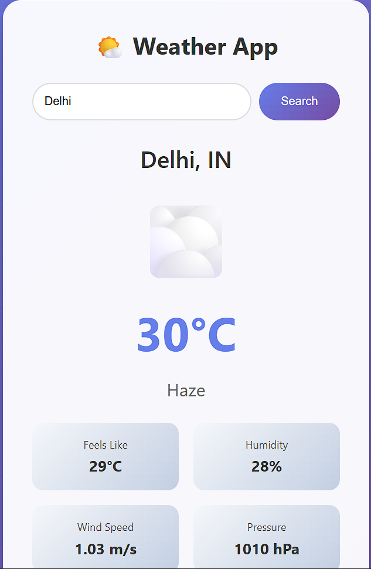

# 🌤️ Weather App

A beautiful and responsive weather application built with HTML, CSS, and JavaScript that displays real-time weather information for any city in the world.



## ✨ Features

- 🔍 Search weather by city name
- 🌡️ Display current temperature in Celsius
- 💨 Show detailed weather information:
  - Feels like temperature
  - Humidity percentage
  - Wind speed
  - Atmospheric pressure
- 🎨 Modern gradient UI design
- 📱 Fully responsive layout
- 🎭 Animated weather icons
- ⚡ Smooth transitions and animations
- ⌨️ Enter key support for quick search

## 🚀 Demo

[Live Demo](https://current-weather-view.netlify.app/)

## 📸 Screenshots

### Desktop View


### Mobile View


## 🛠️ Technologies Used

- **HTML5** - Structure
- **CSS3** - Styling & Animations
- **JavaScript (ES6+)** - Functionality
- **OpenWeatherMap API** - Weather Data

## 📋 Prerequisites

Before running this project, you'll need:

- A modern web browser (Chrome, Firefox, Safari, Edge)
- An API key from [OpenWeatherMap](https://openweathermap.org/api)

## ⚙️ Installation & Setup

1. **Clone the repository**
   ```bash
   git clone https://github.com/yourusername/weather-app.git
   cd weather-app
   ```

2. **Get your API Key**
   - Go to [OpenWeatherMap](https://openweathermap.org/api)

3. **Configure the API Key**
   - Open `script.js`
   - Replace `YOUR_API_KEY_HERE` with your actual API key:
   ```javascript
   const API_KEY = 'your_actual_api_key_here';
   ```

4. **Run the application**
   - Simply open `index.html` in your web browser
   - Visit `http://localhost:8000` in your browser

## 📁 Project Structure

```
weather-app/
│
├── index.html          # Main HTML file
├── style.css           # CSS styles
├── script.js           # JavaScript functionality
├── README.md           # Project documentation
└── screenshots/        # Screenshots folder (optional)
```

## 🎯 Usage

1. Open the application in your browser
2. Enter a city name in the search box
3. Click the "Search" button or press Enter
4. View the current weather information for that city

## 🌐 API Reference

This project uses the [OpenWeatherMap Current Weather Data API](https://openweathermap.org/current)

**Endpoint:**
```
https://api.openweathermap.org/data/2.5/weather?q={city}&appid={API_KEY}&units=metric
```


## 📝 License

This project is licensed under the MIT License - see the [LICENSE](LICENSE) file for details.

## 👤 Author

**Aamir**

- GitHub: [@yourusername](https://github.com/yourusername)
- LinkedIn: [Your LinkedIn](https://linkedin.com/in/yourprofile)

## 🙏 Acknowledgments

- Weather data provided by [OpenWeatherMap](https://openweathermap.org/)
- Icons: Emoji weather icons
- Inspiration: Modern weather app designs

## 📧 Contact

For any questions or suggestions, feel free to reach out:
- Email: your.email@example.com
- Twitter: [@yourhandle](https://twitter.com/yourhandle)

---

⭐ If you found this project helpful, please give it a star!

**Made with ❤️ by Aamir**
